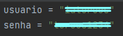

### Avaliador: Alex de Araujo Regazzo
### Envolvidos no desenvolvimento: Renan, Robson
### Nota: 8

# Recomendações

1. Não usar credenciais no código



2. Não usar hardcode
3. Não usar loopings desnecessários: nesse caso poderia ser realizado de outra forma 
* Antes
```python
exemplos = ['apenas_um']
for exemplo in exemplos:
    print(exemplo)
```
* Depois
```python
print('apenas_um')
```